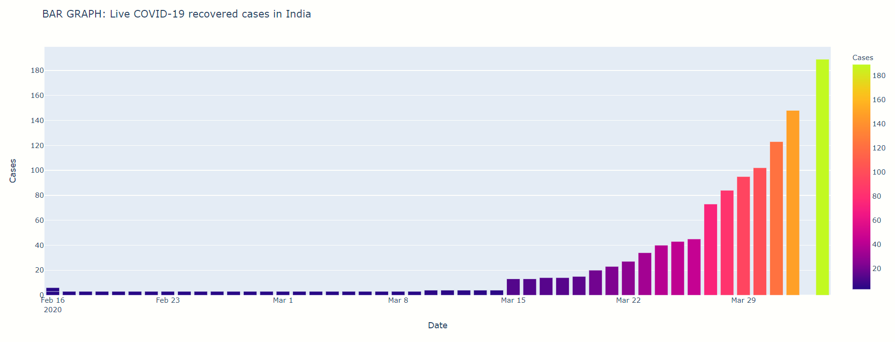
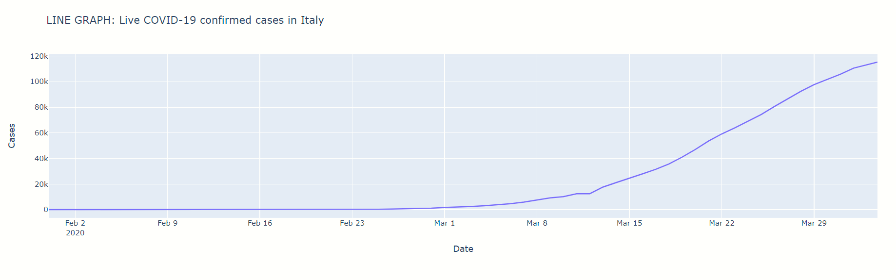
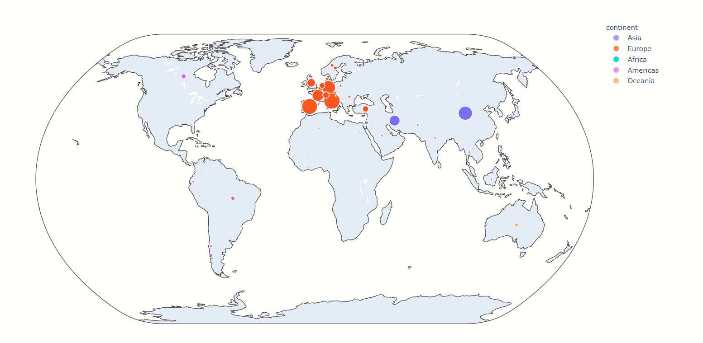
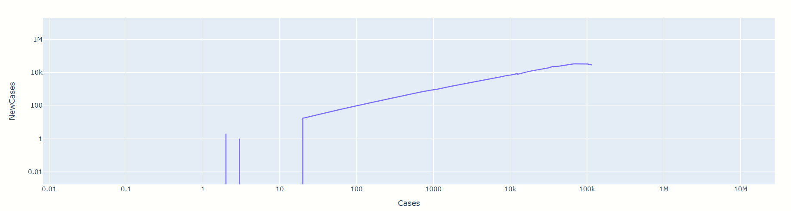

# COVID19 Data Analysis
 ---------------
 A COVID-19 Data Analysis.
 *Libraries Used:* Pandas, Plotly
 *Frameworks Used:* Dash

## Bar Graph 

Indicates the number of cases with time in a given country( i.e. entered through console)

## Line Graph

Indicates the number of cases with time in a given country( i.e. entered through console)

## Bubble Map

Indicates the total number of confirmed cases across the world through a map.

## Markers Graph

Indicates the position of the point indicating plot of newly confirmed cases vs the the total confirmed cases. This takes the current data of a country and plots the point. The Graph analyses the position of a given country compared to the others at a point of time.

## Logarithmic Plot: New Confirmed Vs. Total Confirmed

Given is the Logarithmic Plot of all the new confirmed cases (within one week) against all the cases. This plot gives a much better understanding of the pandemic's Trajectory, hence it makes it easier to predict the future trajectory just by looking at it. Since by looking at an exponential function graph one can't predict when the increasing nature of it will come to an end.
